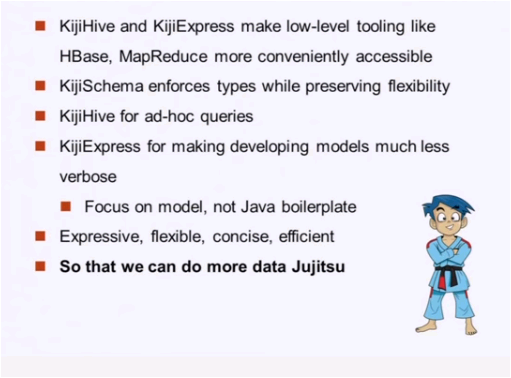
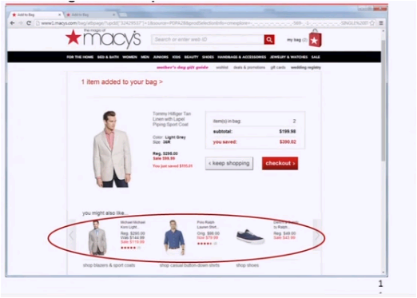

# Real-time recommendation systems use in Macy's
Sreejaya  
Thursday, June 23, 2016  

###Real-time recommendation systems in Macy's###

 
__The video I watched was from Recsys 2014 on 'Real-time recommendation systems use in Macys' by Daqing Zhao and Rakesh Sharma.__ 

https://www.youtube.com/watch?v=urt504mwMtA&index=17&list=PL87GtQd0bfJzKchA4yIQBgy7RlvxnPTfZ
 

Macy's transaction system is Omni channel - means you can do both online and in store transactions. There are so many customers, so much data, a lot of tools and a lot of innovative things happen.

The main challenge in front of the data scientist team was how to apply these technologies to engage customers and change customer behavior also provide right message to right customers at right time. For that they collaborate with IT teams internally as well as 3rd party vendors like WibiData and SAS Research. The team uses latest technologies like Hadoop, Cassandra, Kafka, Scala, R as well as KIJI Models.

The team suggest Kiji framework as a great tool for building big data apps. Kiji schema hides the low level stuff of map reduce. KijiScoring lets developers create real-time predictive models and scoring functions.

The team uses 2 types of models.

  **1.  Item-item set**  
  **2.	Collaborative filtering (similar and complimentary products)**
  
The example they used in the video is
Say a customer added an item to the bag, instead of recommending different kinds of the same item, using collaborative filtering the system recommends different items similar customers bought with that product.

